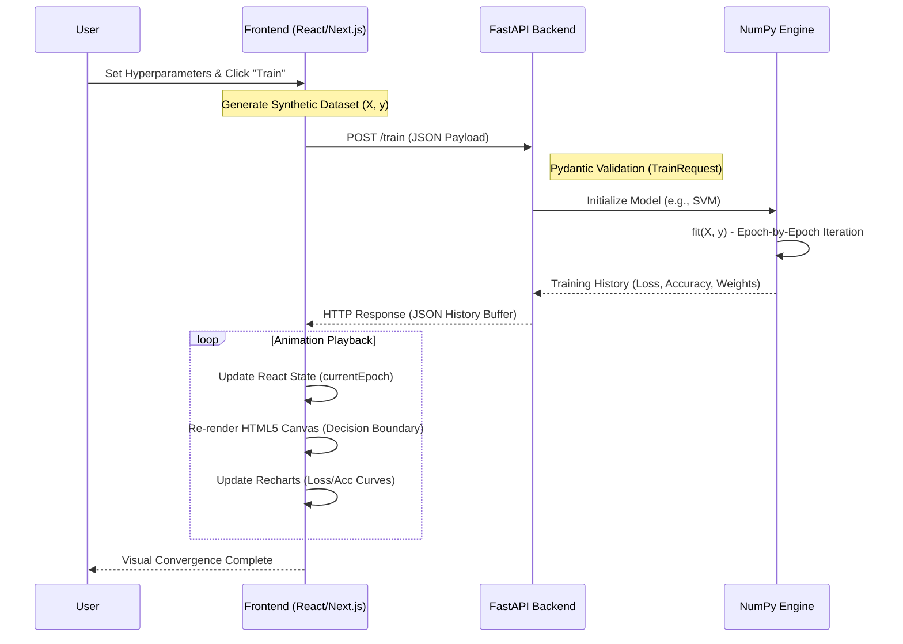
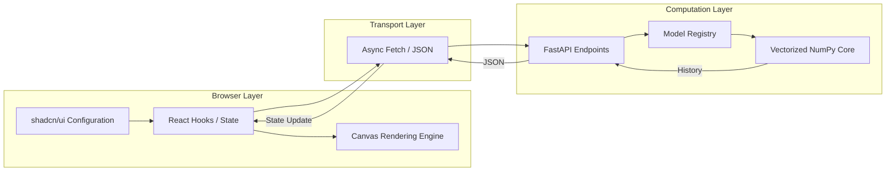
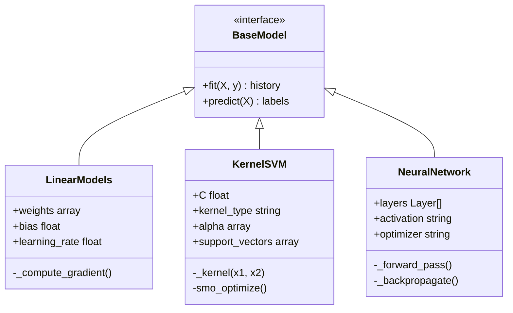
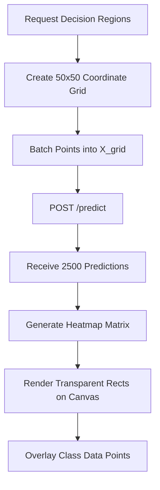

# Architecture

This section provides a comprehensive deep-dive into the High-Level and Low-Level design of Optimizer-Lens. The system is architected as a decoupled, asynchronous machine learning environment where the frontend handles the visual "playback" of training history while the backend serves as a high-performance mathematical engine.

## High-Level Design (HLD)

The HLD illustrates the "Bridge Pattern" between the Next.js runtime and the Python mathematical core.

### System topology & data flow

This diagram tracks a single training request from the user's interaction in the UI through the computation layer and back to the canvas renderer.

### Component interaction layer

## Low-Level Design (LLD)

The LLD focuses on the internal mechanics of the NumPy engine and how the frontend renders non-linear boundaries.

### Core class hierarchy

Our Python backend uses a consistent interface for all machine learning models, allowing the API to handle diverse algorithms (Linear, SVM, Trees, NN) through a unified call pattern.

### Boundary rendering strategy

One of the most complex parts of the frontend is rendering non-linear decision boundaries for algorithms like SVM and Neural Networks.

## Implementation principles

- **Vectorization over Iteration:** All mathematical operations in `core/` use NumPy's vectorized broadcasting rather than Python loops to minimize overhead during training.
- **Stateful API:** The backend maintains the `trained_model` in global memory, ensuring that the `/predict` endpoint is always instantaneous for a given dataset.
- **Canvas Buffering:** The frontend uses an off-screen canvas reference to calculate boundary positions before flushing them to the main UI thread, preventing flicker during high-speed training playback.

<!-- prettier-ignore -->
> [!TIP]
> To see these principles in action, open the browser's **Network Tab** while clicking "Train". You can inspect the massive JSON history buffer that fuels the real-time animations.
